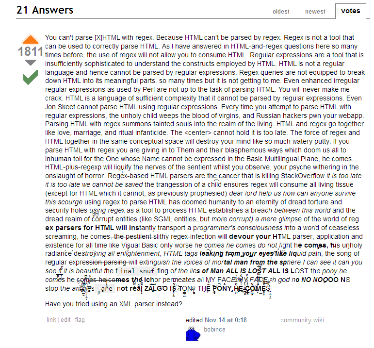

XPath is very powerful, it's kind of a query language like SQL but for XML documents, including HTML documents, so it is a natural fit for web scraping. A lot of people never learn it and use CSS selectors and regex, and have a really hard time scraping anything complicated.

Regex is great for parsing text, but not XML/HTML -- see [this famous StackOverflow answer](http://stackoverflow.com/questions/1732348/regex-match-open-tags-except-xhtml-self-contained-tags/1732454#1732454) about it:

CSS selectors are useful but not quite as powerful as XPath.

A simple example of XPath looks like this: `//div[contains(@class, "price")]//text()` This means "look for any div whose `class` attribute contains 'price', and give me the text inside each of those divs". The result might be something like ["$39","$42"] if our divs are `
$34
 ... blah blah ... 
$42
`.

For testing out and tweaking your XPath queries, the best tool I know is this Firefox plugin: https://addons.mozilla.org/en-US/firefox/addon/xpath-checker/ -- it gives you a pretty-looking CSS-styled view of what a given XPath query returns. It's much easier than looking at the raw HTML. I don't know of any good extensions in Chrome.

I learned from http://www.w3schools.com/xsl/xpath_intro.asp but I found that site really hard to follow for anything but the basics.

# TODO: A REAL XPATH TUTORIAL HERE

Check out this incredibly handy cheat sheet:
http://ricostacruz.com/cheatsheets/xpath.html
