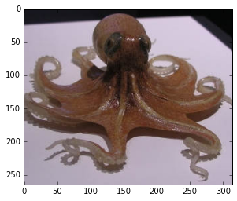

# Image Classification in Python with Visual Bag of Words (VBoW)

[Part 1](../how-to-sift-opencv/)

[Part 2](../visual-bag-of-words/)

## Part 1: Feature Generation with SIFT

### Why we need to generate features

Raw pixel data is hard to use for machine learning, and for comparing images in general.

A digital image in its simplest form is just a matrix of pixel intensity values. Why not flatten this matrix to an array of pixel intensities and use that as your feature set for an image classifier? For simple, curated images like the 20x20 pixel [MNIST digit dataset](http://yann.lecun.com/exdb/mnist/), the raw pixel method can lead to a successful machine learning model. Each image has already been centered in the frame, and all the images have the same aspect ratio and same number of pixels.


But what about images that are less simple and less curated?

Imagine taking several pictures of an object with a handheld camera. Since it's the same camera, the photos will have the same resolution and aspect ratio, so the pixel matrices will be the same size & shape.

Consider this stereo image (via http://www.waystation.net/) of an octopus:
 (PS: if you cross your eyes it will look 3D)

Even though the two photos were taken simultaneously from locations a few inches apart, and they are very visually similar, the raw pixel locations do not match up at all. Every pixel location has been shifted and transformed in a complex way.

#### The problem of scale

Photographs of the same objects will also change scale depending on focal length, distance from object, et cetera. This is another reason that raw pixel values are typically not good features for images. You can see how zooming in on the octopus will totally throw off the pixel locations:


### Generating features with SIFT: Scale-Invariant Feature Transform

We want features that correspond to "parts" of images, at a more holistic level than raw pixels. We want features that are not sensitive to changes in image resolution, scale, rotation, changes in illumination (eg, position of lights). The SIFT algorithm will do this. It's going to be a little complicated, so I'll start by showing you how to do it in Python with OpenCV first, then we can go into how it works. In my <a href="../visual-bag-of-words">next post</a> I'll show you how to convert SIFT features to a format that can be passed directly into a Random Forest, SVM, or other machine learning classifier.

#### Aside: installing OpenCV 3.1.0
SIFT is a patented algorithm and isn't included in many distributions of OpenCV. Also, OpenCV's function names change drastically between versions, and old code breaks! It will save you a lot of pain if you're on the same version as me (v3.1.0) for this tutorial. And you'll need the "nonfree" modules to have SIFT.

After struggling for some time trying to get OpenCV to compile from source, I came across [River City Labs's guide to installing OpenCV in Anaconda Python](https://rivercitylabs.org/up-and-running-with-opencv3-and-python-3-anaconda-edition/). Here is the gist of it.

To set up a conda virtual environment called `opencv`, install Anaconda then run this in the console:

    conda create -n opencv numpy scipy scikit-learn matplotlib python=2.7
    source activate opencv
    conda install -c https://conda.binstar.org/menpo opencv3

Enter your virtual environment with `source activate opencv` and leave it with `source deactivate`.

Another problem I ran into is that I run ipython in interactive mode all the time, and when you call `ipython`, it will ignore your conda env. So I added this to my `.bashrc`:

    # virtualenv-aware ipython
    alias ipy="python -c 'import IPython; IPython.terminal.ipapp.launch_new_instance()'"

Make sure to restart `bash` so it will load the new `.bashrc`.

Now you can invoke a virtualenv-aware ipython shell with the new command `ipy`. You can also launch `jupyter notebook` while within the `opencv` env without a problem, with or without this change to `.bashrc`.

Phew, I hope that wasn't too bad. On to the code!

# Generating SIFT Features in Python OpenCV

```
%matplotlib inline
import cv2
import numpy as np
import matplotlib.pyplot as plt

print 'OpenCV Version (should be 3.1.0, with nonfree packages installed, for this tutorial):'
print cv2.__version__

# I cropped out each stereo image into its own file.
# You'll have to download the images to run this for yourself
octo_front = cv2.imread('../../images/Octopus_Far_Front.jpg')
octo_offset = cv2.imread('../../images/Octopus_Far_Offset.jpg')

def show_rgb_img(img):
    """Convenience function to display a typical color image"""
    return plt.imshow(cv2.cvtColor(img, cv2.CV_32S))
```

    OpenCV Version (should be 3.1.0, with nonfree packages installed, for this tutorial):
    3.1.0


```
show_rgb_img(octo_front);
```


```
show_rgb_img(octo_offset);
```





### Generating SIFT features

First, convert the images to greyscale


```
def to_gray(color_img):
    gray = cv2.cvtColor(color_img, cv2.COLOR_BGR2GRAY)
    return gray

octo_front_gray = to_gray(octo_front)
octo_offset_gray = to_gray(octo_offset)

plt.imshow(octo_front_gray, cmap='gray');
```


```
def gen_sift_features(gray_img):
    sift = cv2.xfeatures2d.SIFT_create()
    # kp is the keypoints
    #
    # desc is the SIFT descriptors, they're 128-dimensional vectors
    # that we can use for our final features
    kp, desc = sift.detectAndCompute(gray_img, None)
    return kp, desc

def show_sift_features(gray_img, color_img, kp):
    return plt.imshow(cv2.drawKeypoints(gray_img, kp, color_img.copy()))

# generate SIFT keypoints and descriptors
octo_front_kp, octo_front_desc = gen_sift_features(octo_front_gray)
octo_offset_kp, octo_offset_desc = gen_sift_features(octo_offset_gray)

print 'Here are what our SIFT features look like for the front-view octopus image:'
show_sift_features(octo_front_gray, octo_front, octo_front_kp);
```

    Here are what our SIFT features look like for the front-view octopus image:


We can also visualize how the SIFT features match up each other across the two images.


```
# create a BFMatcher object which will match up the SIFT features
bf = cv2.BFMatcher(cv2.NORM_L2, crossCheck=True)

matches = bf.match(octo_front_desc, octo_offset_desc)

# Sort the matches in the order of their distance.
matches = sorted(matches, key = lambda x:x.distance)

# draw the top N matches
N_MATCHES = 100

match_img = cv2.drawMatches(
    octo_front, octo_front_kp,
    octo_offset, octo_offset_kp,
    matches[:N_MATCHES], octo_offset.copy(), flags=0)

plt.figure(figsize=(12,6))
plt.imshow(match_img);
```


Most of the matched points correspond to each other between the two images, despite perspective shift and some scaling.


# What is SIFT doing?

I will give a very simplified, intuitive, visual description of the SIFT algorithm here.

For a nice overview of SIFT with pictures, see https://gilscvblog.com/2013/08/18/a-short-introduction-to-descriptors/

For an in-depth explanation, see http://docs.opencv.org/3.1.0/da/df5/tutorial_py_sift_intro.html

For the deepest depth, read the original academic paper https://www.cs.ubc.ca/~lowe/papers/ijcv04.pdf

## 1) Difference of Gaussians

If you've messed with Photoshop or GIMP you know what a Gaussian blur is. You set the "size" of the blur in pixels -- this number is also called `sigma`. Then you get a uniformly blurred image.

The Difference of Gaussians (DoG) is easy to do in Photoshop/GIMP. First greyscale the image. Then duplicate the layer a few times and do a Gaussian Blur on each one with a different sigma value. Finally, set the layer blending mode to "Difference" for all the layers, and look at any 2 layers.

"Difference" simply subtracts the pixel intensities of corresponding pixels: `difference[x][y] = layer1[x][y] - layer2[x][y]`.

I did this with my stereo octopus image. Here are a few DoG results:

<style>.gauss {height: 400px;}</style>

#### sigmas: 10, 5


#### sigmas: 25, 5


#### sigmas: 25, 10


#### sigmas: 100, 25


By doing Difference of Gaussians at different scales, we can see features that appear small and large in the image. In contrast if we only looked at the 100, 25 DoG, we would lose a lot of detail. If we looked only at the 25, 5 DoG, we would miss out on larger-scale features.

Immediately you can see how edges are suddenly very apparent. DoG functions as an edge detector. However, **we do NOT want to use edges** as feature-rich areas for SIFT. We want our SIFT features to be at intrinsically interesting blobs, not edge blobs. We can start again from the original image and use an edge detector to determine edges (I used Sobel, canonical SIFT uses its own):

#### Edge detector output


#### Remove edges from DoG (sigma 25, 10) -- "Artist's Rendering"


## Keypoint detection
Now with the edges removed, we will go over different image scales and find at which scale an interesting blob is best represented. In image classification literature, the scale of a feature is called the "octave". So for each interesting blob we save its octave, x, and y coordinates as a keypoint.

## Rotation normalization
We want to be able to match features regardless of their orientation, so that we can match a part of an eye or tentacle no matter how the eye or tentacle is rotated. To solve this problem, SIFT features are assigned an "orientation" based on the pixel intensities of the surrounding area.

Essentially, you can imagine that we have some rule about orientation -- for example, we could make a rule that the direction pointing from the center of the feature to brightest region of neighboring pixels is selected as a feature's "orientation" direction. Then we turn the feature so that "orientation" (the brightest region) is pointing upwards. Now all similar features will "line up" with each other, even if they are rotated differently in the images they come from:


## Keypoint descriptor generation
We finally have our keypoints: x, y, and octave locations for all our points of interest, plus orientation. The keypoints are scale-invariant and rotation-invariant. We could probably take raw intensity values from each keypoint region at this point and come up with a half-decent match on similar features. However, SIFT takes it a step further by instead generating descriptors for each keypoint not with raw intensity values, but by computing the **gradient** of each pixel (a gradient is a vector of partial derivatives, so for a pixel its gradient describes how intensity changes as X and Y change). Then it bins the gradients into 8 directions (like N, NE, E, SE, S, SW, W, NW) and builds an 8-bin histogram.

One advantage of this process, called histogram of oriented gradients, is that it is very robust against changes in illumination conditions across images.

[Gil's CV Blog](https://gilscvblog.com/2013/08/18/a-short-introduction-to-descriptors/) has some great explanatory illustrations of this how SIFT generates its descriptors:

### Compute the gradient for each pixel at a given octave:

*via Gil's CV Blog*

### Divide the feature region into 16 square subregions. Bin each region into an 8-direction histogram

*via Gil's CV Blog*

### Concatenate the 16 histograms together to get the final 128-element SIFT descriptor!

*via Gil's CV Blog*

#### Here's a real-life descriptor from our octopus

```
octo_front_desc[0]
```


    array([   1.,    0.,    0.,    0.,    0.,    0.,    0.,    1.,   65.,
              6.,    1.,    0.,    0.,    0.,    2.,   24.,  195.,    1.,
              0.,    0.,    0.,    0.,    0.,  123.,   72.,    0.,    0.,
             12.,   14.,    2.,    2.,   37.,    2.,    2.,    0.,    0.,
              0.,    0.,    1.,    1.,  141.,   12.,    0.,    0.,    0.,
              0.,    2.,   27.,  195.,   34.,    2.,    4.,    3.,    1.,
              0.,   88.,   54.,   10.,    4.,   38.,   48.,    6.,    1.,
             21.,    3.,    1.,    1.,    0.,    0.,    0.,    1.,    5.,
            139.,   19.,    4.,    1.,    0.,    0.,    2.,   12.,  195.,
             73.,    3.,    3.,    1.,    1.,    0.,    2.,   52.,   17.,
              5.,   24.,   15.,    7.,    6.,    3.,    1.,    1.,    2.,
              1.,    0.,    0.,    2.,    2.,   81.,   17.,    4.,    2.,
              0.,    0.,    4.,    6.,  195.,   81.,    0.,    0.,    0.,
              0.,    0.,    1.,   59.,   18.,    0.,    3.,   10.,    3.,
              1.,    1.], dtype=float32)


Let's inspect a keypoint object that we generated earlier.


```
print len(octo_front_kp), 'keypoints in the list'
print octo_front_kp[0]
```

    416 keypoints in the list
    <KeyPoint 0x7f7dd3ad47e0>


```
def explain_keypoint(kp):
    print 'angle\n', kp.angle
    print '\nclass_id\n', kp.class_id
    print '\noctave (image scale where feature is strongest)\n', kp.octave
    print '\npt (x,y)\n', kp.pt
    print '\nresponse\n', kp.response
    print '\nsize\n', kp.size

print 'this is an example of a single SIFT keypoint:\n* * *'
explain_keypoint(octo_front_kp[0])
```

    this is an example of a single SIFT keypoint:
    * * *
    angle
    79.6034545898

    class_id
    -1

    octave (image scale where feature is strongest)
    12714495

    pt (x,y)
    (145.86351013183594, 10.573795318603516)

    response
    0.0161379538476

    size
    2.14202713966


```
print 'SIFT descriptors are vectors of shape', octo_front_desc[0].shape
print 'they look like this:'
octo_front_desc[0]
```

    SIFT descriptors are vectors of shape (128,)
    they look like this:


    array([   1.,    0.,    0.,    0.,    0.,    0.,    0.,    1.,   65.,
              6.,    1.,    0.,    0.,    0.,    2.,   24.,  195.,    1.,
              0.,    0.,    0.,    0.,    0.,  123.,   72.,    0.,    0.,
             12.,   14.,    2.,    2.,   37.,    2.,    2.,    0.,    0.,
              0.,    0.,    1.,    1.,  141.,   12.,    0.,    0.,    0.,
              0.,    2.,   27.,  195.,   34.,    2.,    4.,    3.,    1.,
              0.,   88.,   54.,   10.,    4.,   38.,   48.,    6.,    1.,
             21.,    3.,    1.,    1.,    0.,    0.,    0.,    1.,    5.,
            139.,   19.,    4.,    1.,    0.,    0.,    2.,   12.,  195.,
             73.,    3.,    3.,    1.,    1.,    0.,    2.,   52.,   17.,
              5.,   24.,   15.,    7.,    6.,    3.,    1.,    1.,    2.,
              1.,    0.,    0.,    2.,    2.,   81.,   17.,    4.,    2.,
              0.,    0.,    4.,    6.,  195.,   81.,    0.,    0.,    0.,
              0.,    0.,    1.,   59.,   18.,    0.,    3.,   10.,    3.,
              1.,    1.], dtype=float32)


```
# visualized another way:
plt.imshow(octo_front_desc[0].reshape(16,8), interpolation='none');
```


