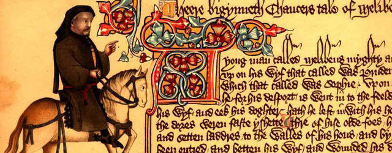
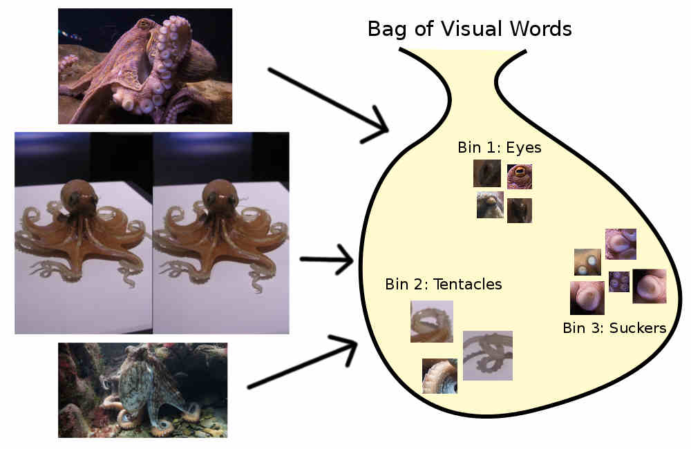
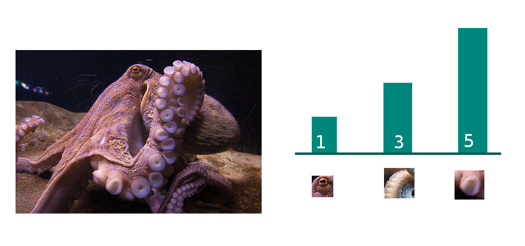

# Image Classification in Python with Visual Bag of Words (VBoW)

[Part 1](../how-to-sift-opencv/)

[Part 2](../visual-bag-of-words/)

## Part 2: The Visual Bag of Words Model

### What is a Bag of Words?

In the world of natural language processing (NLP), we often want to compare multiple documents. Documents each have a bunch of different words in a certain order. We will ignore the order and just throw the words into a bag. Then we can simply count the occurences of each word in the corpus of all words. Finally, each document is converted to a histogram of word counts, and that can be used as features for machine learning.

We make our corpus of all words from taking the set of all the words in the all documents within our training set. The test set documents can have words that don't show up in the corpus -- those words will just be ignored. We have to do this because in order to feed data into a machine learning classifier, each observation must have the same number of features: we can't have one document with 100 features and another with 104 features.

### Non-standard words?

On many documents we can do an exact match for words, because modern English spelling is pretty standardized. We always spell `herself` as `herself`. But if we take some Middle English from Chaucer's Canturbury Tales, we will find that `herself` is spelled <a href='http://sites.fas.harvard.edu/~chaucer/spelling.htm'>many ways:</a> hire-self,  herself, herselven, hireself, hireselve, hireselven, hirself, hirselve, hirselven, hirsilf, hyreself, and hyrself.

*Excerpt:*

``` text
The coper teyne, noght knowing this preest,
And hidde it, and him hente by the breest,
And to him spak, and thus seyde in his game,
'Stoupeth adoun, by god, ye be to blame,
Helpeth me now, as I dide yow whyl-er,
Putte in your hand, and loketh what is ther.'
```



If we have a bunch of documents in Middle English and make a histogram of the whole corpus, we'll count `hirselve`, `hirsilf`, and `hyreself` as totally different words. It will be hard to figure out which documents are talking about women. Because spelling variation is such a big issue, we need some way to **cluster** all the variants of a word together so that they wind up in the same bin.

### "Visual words"

In the <a href="../how-to-sift-opencv/">previous post</a> I explained what SIFT descriptors are and how to generate them. If we think of every picture as a document of SIFT "words", we can extend the bag of words model to classify images instead of text documents. We might imagine that one SIFT descriptor "visual word" represents an octopus eye, another one represents a tentacle "suction cup", and so on.

These visual words have spelling variations, just like Middle English, so we have to have some clustering method to bin together the words that represent the same thing. All the eye features should go to the same bin, all the tentacle suckers in their own bin. It's more intuitive to think of the bins as being **codewords** like "eye features" and "tentacle features".

However, SIFT features are not so literal as "octopus eye", they tend to represent something more like "bright blob which gradually blends into darkish blob with a diagonal oblong midtone blob". We can't bin them together based on some human-meaningful definition. But we can bin them together mathematically. SIFT descriptors are 128-dimensional vectors, so we can simply make a matrix with every SIFT descriptor in our training set as its own row, and 128 columns for each of the dimensions of the SIFT features. Plug that matrix to a clustering algorithm like KMeans, then get the descriptors clustered into K different codewords (ie, K different clusters, or K different bins).



Next we go through each individual image, and assign all of its SIFT descriptors to the bin they belong in. All the "eye" SIFT descriptors will be converted from a 128-dimensional SIFT vector to a bin label like "eye" or "Bin number 4".  Finally we make a histogram for each image by summing the number of features for each codeword. For example, with K=3, we might get a total of 1 eye feature, 3 tentacle features, and 5 tentacle sucker features for image number 1; a different distribution for image number 2, and so on. (Remember, this is just a metaphor: real SIFT feature clusters won't have such a human-meaningful definition.)



<div style='text-align: center;'>Image 1 --> <code>[1, 3, 5]</code></div>

At this point we have converted images with varying numbers of SIFT features into K features. We can feed the matrix of M observations and K features into a classifier like AdaBoost or SVC as our `X`, image labels as our `y`, and it ought to be able to predict image labels from images with some degree of accuracy.

### But what is K? How many bins do we need?

For my panda detector project I performed a **grid search** across a range of K values and compared the scores of classifiers for each K. My grid search code is <a href="https://github.com/IanLondon/general_img_classifier/blob/master/K_grid_search.py">on GitHub</a> and references other files in <a href="https://github.com/IanLondon/general_img_classifier">the repo</a>.

Determining what K to use for K-means <a href="https://en.wikipedia.org/wiki/Determining_the_number_of_clusters_in_a_data_set">is an art, not a science</a>, so depending on your project (and how long it takes to do a grid search) you might want to try different methods.
