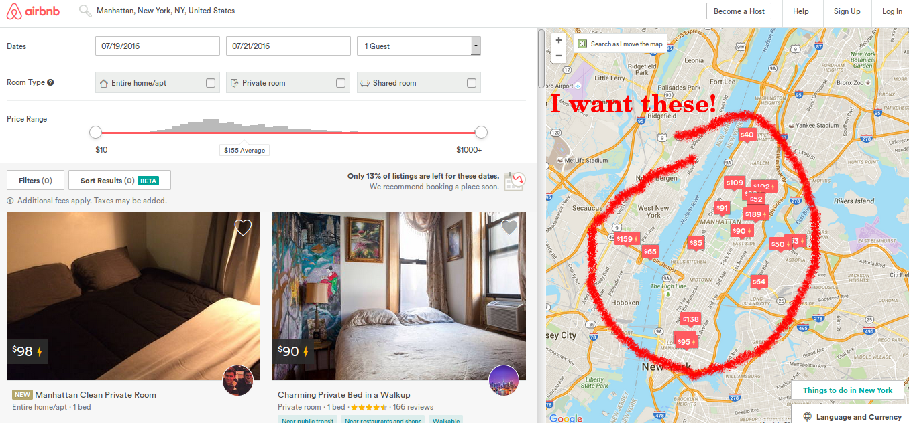
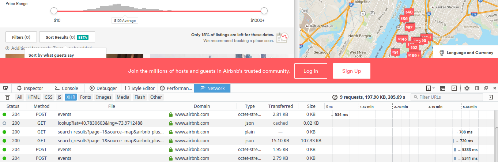
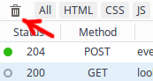
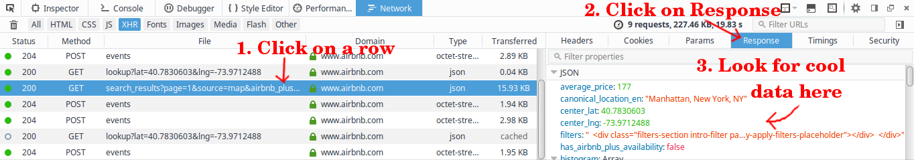
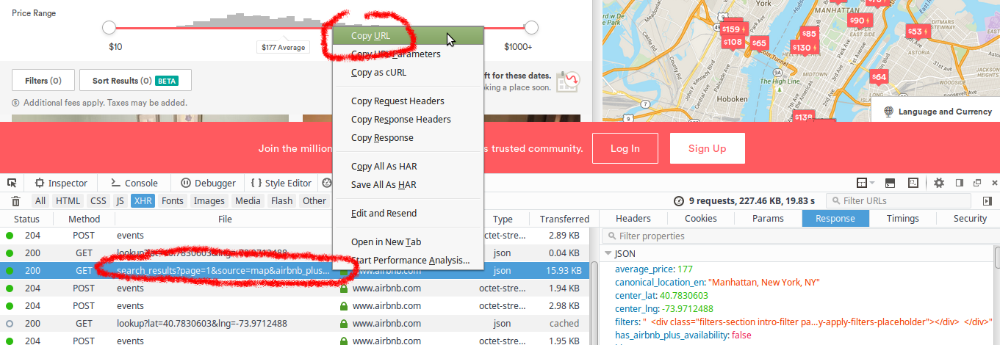

I was trying to help someone with a web scraping task today, and stumbled upon an interesting technique to find hidden APIs to scrape data from certain websites. Some sites use frontend frameworks which render dynamic content by loading a JSON or XML file from their backend to populate the user-facing site. I'm going to show you how to find the URL to access that dynamic content so you can easily scrape data from a site, without `lxml` or `BeautifulSoup` or CSS selectors or XPath. Just nice, simple JSON.

Airbnb.com uses this kind of framework (specifically [Backbone](http://backbonejs.org/) and [Handlebars](http://handlebarsjs.com/), I think??). Let's go through and find how to access their backend API to scrape data about listings in a given area.

I stumbled upon the JSON API because I wanted to scrape the latitude and longitude of the pins on their embedded Google Maps map.



I knew that Google Maps API doesn't store pin locations -- you have to construct the markers with JavaScript in the browser for pins to show up. I briefly looked at the JavaScript sources to see how this worked but found out the .js resources are minified and obfusticated. I quickly looked elsewhere.

# Watching Network Traffic with Firefox Developer Tools

The **Network** tab in Firefox's Developer Tools (hit Ctrl+Shift+Q in plain old vanilla Firefox for it to pop up) is a powerful tool that lets you examine all the network traffic generated by the code running on the website you're viewing.



There are quite a few requests to wade through. Since Airbnb has the option "Search as I move the map", I figured I could clear the Network tab first then move the map so I'd have a much smaller haystack to search through. To clear the saved requests, click the trash can icon:



Then move the map. Several rows should appear in the network tab. Click the `XHR` button to see only XHR events. XHR should be blue, the rest grayed out. XHR stands for XMLHttpRequest, which is what the frontend will use to make an HTTP request to the backend. What we are looking for will probably be a `GET`, but it's possible for it to be something else if the web devs are doing something weird.

To browse through the data content of each response, click on the row, then a new "details window" will pop up on the right. Click the `Response` tab to show the data returned by that network event. Browse around to see if you find anything cool.



Finally once you find a response with cool data, you need to get its URL so you can make your own request. Right-click the row of the response you want, and select "Copy URL". Boom!



The URL I got looks like this: https://www.airbnb.com/search/search_results?page=1&source=map&airbnb_plus_only=false&sw_lat=40.72108459066701&sw_lng=-74.10145395441896&ne_lat=40.81249944772398&ne_lng=-73.88069742365724&search_by_map=true&location=Manhattan%2C+New+York%2C+NY%2C+United+States&checkin=07%2F19%2F2016&checkout=07%2F21%2F2016&guests=&ss_id=4nufl4i6

If I enter that in the browser, I get a bunch of JSON with loads of data about the listings. You may also notice that the search results page number `page` and the range of coordinates (`sw_lat`, `sw_lng` etc) are clearly specified as URL arguments. We have discovered the JSON API for this site's data!

An example for how to get and use this JSON data in Python (requires the requests module: `pip install requests`):

``` python
import requests
import json

#this is pretty print, it just makes JSON more human-readable in the console:
from pprint import pprint

options = dict(
    page_no = 1,
    checkin = "07/15/2016",
    checkout = "07/16/2016",
    sw_lat = "40.83397847641101",
    sw_lng = "-74.0845568169126",
    ne_lat = "40.88991628064286",
    ne_lng = "-73.86380028615088"
)

json_url = "https://www.airbnb.com/search/search_results?page={page_no}&source=map&airbnb_plus_only=false&sw_lat={sw_lat}&sw_lng={sw_lng}&ne_lat={ne_lat}&ne_lng={ne_lng}&search_by_map=true&location=Manhattan,+New+York,+NY,+United+States&checkin={checkin}&checkout={checkout}&guests=1".format(**options)

# download the raw JSON
raw = requests.get(json_url).text

# parse it into a dict
data = json.loads(raw)

# pretty-print some cool data about the 0th listing
pprint( data['results_json']['search_results'][0]['listing'] )
# and price info
pprint( data['results_json']['search_results'][0]['pricing_quote'] )
```

I can now get number of beds, bathrooms, approximate latitude and longitude, host ID, room ID, cost of renting the room, etc. And I can programmatically change the URL arguments to make different queries. This was way easier that writing a web crawler and scraper! Let me know what other interesting hidden APIs you find, or if you have any additional tips.
