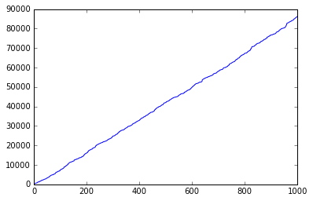
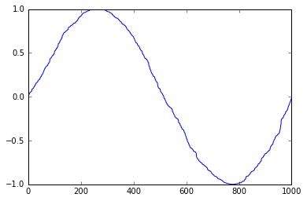
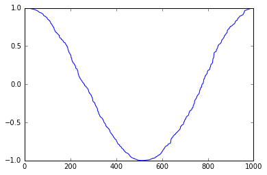
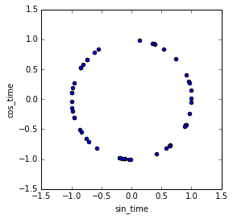

Some data is inherently cyclical. Time is a rich example of this: minutes, hours, seconds, day of week, week of month, month, season, and so on all follow cycles. Ecological features like tide, astrological features like position in orbit, spatial features like rotation or longitude, visual features like color wheels are all naturally cyclical.

Our problem is: how can we let our machine learning model know that a feature is cyclical? Let's explore a simple 24-hour time dataset. The time might be connected to temperature, or exits through a subway turnstile, or anything. But we want to convey its cyclical nature to our model.

First, we'll generate some fake times. Since we're only looking at where the time appears on a 24-hour clock, we can represent the times as seconds past midnight.


```python
%matplotlib inline
import matplotlib.pyplot as plt
import pandas as pd
import numpy as np
```

```python
def rand_times(n):
    """Generate n rows of random 24-hour times (seconds past midnight)"""
    rand_seconds = np.random.randint(0, 24*60*60, n)
    return pd.DataFrame(data=dict(seconds=rand_seconds))

n_rows = 1000

df = rand_times(n_rows)
# sort for the sake of graphing
df = df.sort_values('seconds').reset_index(drop=True)
df.head()
```


<div>
<table border="1" class="dataframe">
  <thead>
    <tr style="text-align: right;">
      <th></th>
      <th>seconds</th>
    </tr>
  </thead>
  <tbody>
    <tr>
      <th>0</th>
      <td>192</td>
    </tr>
    <tr>
      <th>1</th>
      <td>212</td>
    </tr>
    <tr>
      <th>2</th>
      <td>299</td>
    </tr>
    <tr>
      <th>3</th>
      <td>300</td>
    </tr>
    <tr>
      <th>4</th>
      <td>353</td>
    </tr>
  </tbody>
</table>
</div>


Seconds past midnight alone conveys no closeness between data that crosses the "split". Here, the split is at midnight.


```python
df.seconds.plot();
```





Notice that the distance between a point as 5 minutes before and 5 minutes after the split is very large. This is undesirable: we want our machine learning model to see that 23:55 and 00:05 are 10 minutes apart, but as it stands, those times will appear to be 23 hours and 50 minutes apart!

# Transformation into 2 dimensions

Here's the trick: we will create two new features, deriving a sine transform and cosine transform of the seconds-past-midnight feature. We can forget the raw "seconds" column from now on.


```python
seconds_in_day = 24*60*60

df['sin_time'] = np.sin(2*np.pi*df.seconds/seconds_in_day)
df['cos_time'] = np.cos(2*np.pi*df.seconds/seconds_in_day)

df.drop('seconds', axis=1, inplace=True)

df.head()
```


<div>
<table border="1" class="dataframe">
  <thead>
    <tr style="text-align: right;">
      <th></th>
      <th>sin_time</th>
      <th>cos_time</th>
    </tr>
  </thead>
  <tbody>
    <tr>
      <th>0</th>
      <td>0.013962</td>
      <td>0.999903</td>
    </tr>
    <tr>
      <th>1</th>
      <td>0.015416</td>
      <td>0.999881</td>
    </tr>
    <tr>
      <th>2</th>
      <td>0.021742</td>
      <td>0.999764</td>
    </tr>
    <tr>
      <th>3</th>
      <td>0.021815</td>
      <td>0.999762</td>
    </tr>
    <tr>
      <th>4</th>
      <td>0.025668</td>
      <td>0.999671</td>
    </tr>
  </tbody>
</table>
</div>


```python
df.sin_time.plot();
```





Notice that now, 5 minutes before midnight and 5 minutes after is 10 minutes apart, just as we wanted.

However, with just this sine transformation, you get a weird side-effect. Notice that every horizontal line you draw across the graph touches two points. So from this feature alone, it appears that midnight==noon, 1:15am==10:45am, and so on. There is nothing to break the symmetry across the period. We really need two dimensions for a cyclical feature. Cosine to the rescue!


```python
df.cos_time.plot();
```





With an additional out-of-phase feature (cos), the symmetry is broken. Using the two features together, all times can be distinguished from each other.

An intuitive way to show what we just did is to plot the two-feature transformation in 2D as a 24-hour clock. The distance between two points corresponds to the difference in time as we expect from a 24-hour cycle. (I'm just plotting a subset of the data so we can see the individual points).


```python
df.sample(50).plot.scatter('sin_time','cos_time').set_aspect('equal');
```





Voila! We can feed the `sin_time` and `cos_time` features into our machine learning model, and the cyclical nature of 24-hour time will carry over.

## Further reading:

* [http://stats.stackexchange.com/questions/126230/optimal-construction-of-day-feature-in-neural-networks](http://stats.stackexchange.com/questions/126230/optimal-construction-of-day-feature-in-neural-networks)
* [http://datascience.stackexchange.com/questions/5990/what-is-a-good-way-to-transform-cyclic-ordinal-attributes](http://datascience.stackexchange.com/questions/5990/what-is-a-good-way-to-transform-cyclic-ordinal-attributes)
