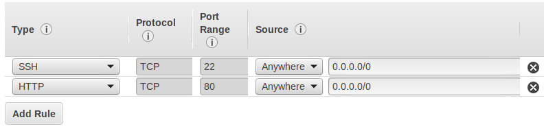

# Why use Apache or Nginx for Flask?

You can simply configure your Flask app to run with the line `app.run(host="0.0.0.0", port=80)` at the end, and get your app running online without using Apache2 by just doing `python myapp.py`.

There are 3 disadvantages of doing this - 1 big and 2 little:

1. The main limitation of relying on `app.run()` is that it uses Flask's built-in server, which was built for local development and not for use in production. It cannot handle much traffic and isn't very robust. Apache and Nginx are battle-tested, high quality, robust web servers that are very widely used in production.
2. If you run `python myapp.py` in an ssh session, your app will close when you close your ssh connection. You can get around this by running it in something like `tmux`.
3. If your server reboots, the app will not start unless you ssh in again and restart it. One way to fix this is by making an upstart job to start the app, but again, you are still using Flask's little development server.

# Is there an easier way?

I was writing a tutorial for the students of [Metis's Data Science Bootcamp](http://www.thisismetis.com) about deploying Flask apps on Linux servers. That tutorial focused on setting up Apache server and mod_wsgi. Several pages in, I decided to change direction. Apache is a huge pain to configure for developers who just want to get something running. Between Flask, Python virtual environments, mod_wsgi, Apache, and the Linux server itself, there are way too many points of failure for a simple tutorial. You wind up needing to know many different ways to debug different components, and you need to check several logs to trace down errors (if they're logged at all). It is simply not simple! Nginx, one of the leading alternative web servers for Flask apps, isn't too easy to set up on a bare machine either (but [here's a good tutorial](https://www.digitalocean.com/community/tutorials/how-to-serve-flask-applications-with-uwsgi-and-nginx-on-ubuntu-14-04) if you're interested).

At the same time, I have been learning about using Docker to speed up the process of getting development and production environments up and running in a portable way. I came across a [Docker image with Flask and NGINX set up](https://github.com/tiangolo/uwsgi-nginx-flask-docker) and found this to be a really easy way to get a Flask app running on a production web server (ie, not with Flask's `app.run` built-in development server).

# Let's start: Launch an EC2 instance

First off launch a new EC2 instance using the Ubuntu image. A free-tier `t2.micro` will be plenty for this tutorial.

Make sure inbound traffic on port 80 (HTTP) is open to the world by allowing it in your security group:


`ssh` into your EC2 instance. If this is your first time connecting to EC2, follow [this guide](https://docs.aws.amazon.com/AWSEC2/latest/UserGuide/AccessingInstancesLinux.html)

# Install the prerequisites

After `ssh`ing into your server, update your packages, then install python, pip, git, and docker. Afterwards, use pip to install virtualenv.

``` bash
sudo apt-get update
sudo apt-get install python-dev python-pip git docker.io
sudo pip install virtualenv
```

Watch that you install `docker.io` and not `docker`, they're different things!

# Set up your project

Even if you are an old hat with Flask, make sure to follow the naming rules and file structure here or things will break.

* Make a new empty directory for your project.
* Set up a virtual environment in a directory called `venv` with the command `virtualenv venv`.
* Activate the virtual environment with `source venv/bin/activate`.
* Make a file `requirements.txt` that has all your dependencies in it. For the simplest flask app, all you need is the line: `Flask==0.11.1`
* Install your dependencies with `pip install -r requirements.txt`
* Make a flask app at `app/main.py`. For the Docker image we will use, you need to do two important things:
    1. Make sure the app is really called `main.py`
    2. Make sure the Flask app variable is really called app. The Flask app variable is declared like `app = Flask(..blah blah..)`. If you call this variable something else like `my_app = Flask(..blah blah..)`, the Docker image won't find it and it will not work!

If you have a complex Flask app with many files, that's fine. Just make sure the file with the line `app = Flask(..blah blah..)` is called `main.py` and is in the `app/` directory.

Here's an example Flask app:

``` python
from flask import Flask

# the all-important app variable:
app = Flask(__name__)

@app.route("/")
def hello():
    return "Oh, Hello World"

if __name__ == "__main__":
app.run(host='0.0.0.0', debug=True, port=80)
```

Lastly you can test your app by doing `python app/main.py`, then go to the IP of your server and make sure it's working.

The project should have the following directory structure. I have a repo  set up [here](https://github.com/IanLondon/simple_flask_docker) with a working example if it helps.

```
root_project_dir/

  Dockerfile

  requirements.txt

  app/
    main.py

  venv/
```

# Make a Dockerfile

A Dockerfile is a file called `Dockerfile` (with no extension - not `Dockerfile.txt` or .sh or whatever) which tells Docker how to build an image. You can follow [this tutorial](https://www.digitalocean.com/community/tutorials/docker-explained-using-dockerfiles-to-automate-building-of-images), see [best practices](https://docs.docker.com/engine/userguide/eng-image/dockerfile_best-practices/), or peruse the [docs](https://docs.docker.com/engine/reference/builder/) for much more detail... there is a *lot* more detail though so I think it's best to just dive in with the world's simplest Dockerfile, which is all we need for this project:

```
FROM tiangolo/uwsgi-nginx-flask:flask

COPY ./app /app
```

## What is happening?

### FROM

This line tells Docker what image to pull from the Docker hub repository (it's like GitHub for Docker containers). The image specified by FROM is the base of the container we are building. User `tiangolo` aka Sebastián Ramírez made this convenient image which has python, flask, nginx, and uWSGI (the bridge between Flask and Nginx) as well as some other tools like git installed for us on a Debian OS.

You can think of a Docker image as a virtual operating system, but with smaller file size and with better efficiency. The `tiangolo/uwsgi-nginx-flask:flask` sets up a Debian Jesse "virtual operating system" which can run on our Ubuntu machine, or on pretty much any machine. The settings, installed programs, and even the operating system of our machine doesn't matter -- Docker makes its own isolated container.

### COPY

This is how our app's code gets incorporated into the Docker container. As you might expect, it copies the `app` directory from our project directory to the Docker container's `/app` directory, overwriting the default app that Sebastián set up in there with our own.

# Docker build

We are now ready to build our docker container. Make sure you are in the root directory of your project, then do `docker build -t my_flask_app .`

This tells Docker to build a container using the project in the present working directory (the `.` at the end), and tag it `my_flask_app` (`-t` stands for "tag"). Docker will pull down the base image `tiangolo/uwsgi-nginx-flask:flask` from Docker Hub, then copy our app code into the container.

## Important note - updating your container with your app!

Every time you change your app code, you need to build the container again! If your Dockerfile is arranged correctly, the build should only take a few seconds.

# Docker run

Now we're ready to run! Assuming you tagged the container as `my_flask_app` like I did above, run it with:

`docker run -p 80:80 -t my_flask_app`

* `-p` connects port 80 of the Docker container to port 80 of your machine, so HTTP can work.
* `-t` again specifies the tag of the container we want to run.

Your flask app should now be running - go to your server's IP address in your browser.

If you get an error like "address already in use" or "port 80 already in use":
1. Make sure your Flask app or another app isn't already running and using port 80
2. Sometimes docker doesn't unbind ports after you close containers, so try `sudo service docker restart` then run your container again.

You can kill the container with <kbd>CTRL + C</kbd>. Notice that if you go to your server's IP in your browser, nothing is there.

# Running persistently

We probably want our app to run in the background, and to restart automatically if our server machine is restarted. So we'll add a few things to our `docker run` command:

`docker run -d --restart=always -p 80:80 -t my_flask_app`

* `-d` runs the Docker container as a daemon in the background
* `--restart=always` restarts the container if it crashes, or if the system docker is running on is rebooted.

There we go!

# Dealing with Daemons

We can see what Docker containers are actively running with `docker ps`. The output will look like:

```
CONTAINER ID        IMAGE               COMMAND                CREATED             STATUS              PORTS                         NAMES
9905adc26eb4        flask_test:latest   "/usr/bin/supervisor   About an hour ago   Up About an hour    0.0.0.0:80->80/tcp, 443/tcp   sleepy_yalow
```

If we want to kill the container, use `docker kill sleepy_yalow` where "sleepy_yalow" is the container name.

# PART 2: A more complex Flask app with dependencies & environmental variables

Notice that we made a requirements.txt file, but we didn't really need it because the Flask module is already included in the base Docker image that we're using.

Let's try a slightly more complex Flask app which uses [pyfiglet](https://github.com/pwaller/pyfiglet) to make a ASCII art version of "hello world". Now we have to actually deal the pyfiglet dependency!

### New `requirements.txt`:

```
Flask==0.11.1
pyfiglet==0.7.5
```

### New Flask app `app/main.py`:

``` python
from pyfiglet import Figlet
import os
from flask import Flask

app = Flask(__name__)

font = Figlet(font="starwars")

@app.route("/")
def main():
    # get the message from the environmental variable $MESSAGE
    # or fall back to the string "no message specified"
    message = os.getenv("MESSAGE", "no message specified")

    # render plain text nicely in HTML
    html_text = font.renderText(message)\
            .replace(" ","&nbsp;")\
            .replace(">","&gt;")\
            .replace("<","&lt;")\
            .replace("\n","<br>")

    # use a monospace font so everything lines up as expected
    return "<html><body style='font-family: mono;'>" + html_text + "</body></html>"

if __name__ == "__main__":
    app.run(host="0.0.0.0", port=80)
```

### New Dockerfile

We also need a new Dockerfile which will use our requirements.txt file to install the packages we need.

```
FROM tiangolo/uwsgi-nginx-flask:flask

# copy over our requirements.txt file
COPY requirements.txt /tmp/

# upgrade pip and install required python packages
RUN pip install -U pip
RUN pip install -r /tmp/requirements.txt

# copy over our app code
COPY ./app /app

# set an environmental variable, MESSAGE,
# which the app will use and display
ENV MESSAGE "hello from Docker"
```

### Build and run!

``` bash
docker build -t flask_ascii .
docker run -p 80:80 -t flask_ascii
```

You should see:

```
__    __   _______  __       __        ______   
|  |  |  | |   ____||  |     |  |      /  __  \  
|  |__|  | |  |__   |  |     |  |     |  |  |  |
|   __   | |   __|  |  |     |  |     |  |  |  |
|  |  |  | |  |____ |  `----.|  `----.|  `--'  |
|__|  |__| |_______||_______||_______| \______/  

_______ .______        ______   .___  ___.
|   ____||   _  \      /  __  \  |   \/   |
|  |__   |  |_)  |    |  |  |  | |  \  /  |
|   __|  |      /     |  |  |  | |  |\/|  |
|  |     |  |\  \----.|  `--'  | |  |  |  |
|__|     | _| `._____| \______/  |__|  |__|

_______   ______     ______  __  ___  _______ .______      
|       \ /  __  \   /      ||  |/  / |   ____||   _  \     
|  .--.  |  |  |  | |  ,----'|  '  /  |  |__   |  |_)  |    
|  |  |  |  |  |  | |  |     |    <   |   __|  |      /     
|  '--'  |  `--'  | |  `----.|  .  \  |  |____ |  |\  \----.
|_______/ \______/   \______||__|\__\ |_______|| _| `._____|


```

## Using a different environmental variable

You can overwrite many of the commands specified in the Dockerfile, including the environment variables. To change the $MESSAGE var to something else, use the `-e` flag (for "Environment"):

``` bash
docker run -p 80:80 -e MESSAGE="something else" -t flask_ascii
```

## Daemonize it!

If everything's working, run it as an auto-restarting daemon:

``` bash
docker run -d -restart=always -p 80:80 -t flask_ascii
```

# Conclusion

I hope you are now comfortable with the basics of using Docker containers. Another bonus about Docker containers is that they integrate with services like AWS's Elastic Container Service (ECS), which allows you to set up a group of EC2 instances running your app which can auto-scale based on load and also run under a load balancer to send out traffic evenly across the different instances... but that's another blog post!

As always, please reach out with any questions!
